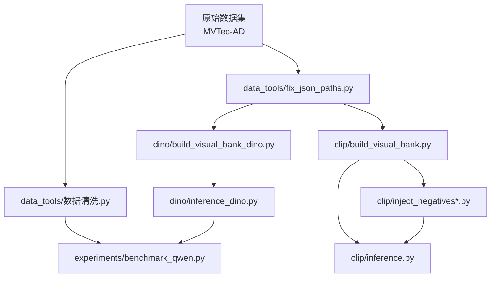

# Scripts 目录总览（SUMMARY）

本目录用于集中管理本项目的各类脚本（构库、推理、数据清洗、实验评测等）。本文件帮助你快速理解整体结构、分类关系以及日常使用方式。

---

## 1. 整体结构说明

当前 `Scripts/` 目录下的分类结构如下：

- `dino/`：基于 **DINOv2** 的视觉检索与热力图生成管线
- `clip/`：基于 **CLIP** 的向量库构建与可视化推理管线
- `data_tools/`：数据路径修复、行业知识清洗等数据工具脚本
- `experiments/`：多模态 RAG 评测、模型对比等实验性脚本

每个子目录都包含一份 `README.md`，详细说明该分类下脚本的用途、调用顺序和注意事项。

---

## 2. 分类关系图

从数据到评测的典型流程可以概括为：

直观理解：

- `data_tools/` 负责把数据和知识“整理干净”，方便后续所有脚本使用。
- `dino/` 与 `clip/` 负责构建向量库并生成热力图等视觉中间结果。
- `experiments/` 负责在上述结果基础上做评测和对比分析。

---

## 3. 快速导航指南

常用脚本及其典型运行方式（默认在项目根目录 `/data/XL/多模态RAG` 下执行）：

| 目标 | 命令示例 | 所属分类 |
| :-- | :-- | :-- |
| 修复 JSON 中的旧路径 | `python Scripts/data_tools/fix_json_paths.py` | `data_tools` |
| 构建 DINO 向量库 | `python Scripts/dino/build_visual_bank_dino.py` | `dino` |
| 为 DINO 索引注入伪造缺陷 | `python Scripts/dino/inject_negatives_dino.py` | `dino` |
| 生成 DINO 热力图拼图 | `export TARGET_CATEGORY=bottle && python Scripts/dino/inference_dino.py` | `dino` |
| 构建 CLIP 向量库 | `python Scripts/clip/build_visual_bank.py` | `clip` |
| 为 CLIP 索引注入伪造缺陷 | `python Scripts/clip/inject_negatives.py` | `clip` |
| 生成 CLIP 热力图可视化 | `python Scripts/clip/inference.py` | `clip` |
| 清洗行业知识 JSON | `python Scripts/data_tools/数据清洗.py` | `data_tools` |
| 运行 Qwen 多模态 RAG 评测 | `python Scripts/experiments/benchmark_qwen.py` | `experiments` |
| 对比 CLIP 与 DINOv2 Patch 表现 | `python Scripts/experiments/compare_models_oneshot.py` | `experiments` |

如需了解某一类脚本的细节，建议先打开对应子目录下的 `README.md` 快速浏览。

---

## 4. 脚本开发规范（约定）

为了让脚本长期可维护、对“小白开发者”友好，建议在本目录新增或修改脚本时遵守以下约定：

1. **文件头部注释块**
   - 每个脚本文件开头必须有一个 Markdown 风格的说明块，至少包含：
     - 文件作用：一句话概括做什么
     - 运行方式：推荐的运行命令、依赖前提
     - 输出结果：会生成什么文件或打印什么信息
     - 分类角色：属于哪个子目录、在整体流程中扮演的角色

2. **路径与常量**
   - 尽量将硬编码路径集中在文件顶部，例如 `DATASET_ROOT`、`OUTPUT_DIR` 等，方便迁移和配置。
   - 运行时默认以项目根目录为当前工作目录（`/data/XL/多模态RAG`），命令示例也按此约定书写。

3. **函数与类编写**
   - 尽量把复杂逻辑封装到类或函数中，在函数级别添加简洁、易懂的中文 docstring，说明“这个函数是干什么的”。
   - 以“先讲人话再讲细节”的方式写注释，优先照顾新人阅读体验。

4. **分类与命名**
   - 新脚本优先按功能归入现有分类（`dino/`、`clip/`、`data_tools/`、`experiments/`）。
   - 若出现全新类型（例如统一的 Web 服务 or CLI 入口），再考虑新增子目录，并补充本 `SUMMARY.md` 与分类 `README.md`。

5. **运行与验证**
   - 每次增加或修改脚本后，至少完成一次**自测运行**，确认主要流程不报错、输出文件位置符合预期。
   - 建议在对应 `README.md` 中追加一两条“实测通过的命令示例”，方便未来复用。

通过以上规范，`Scripts/` 目录可以随着项目演进持续扩展，同时依然保持对新同学友好、对老同学可维护。
